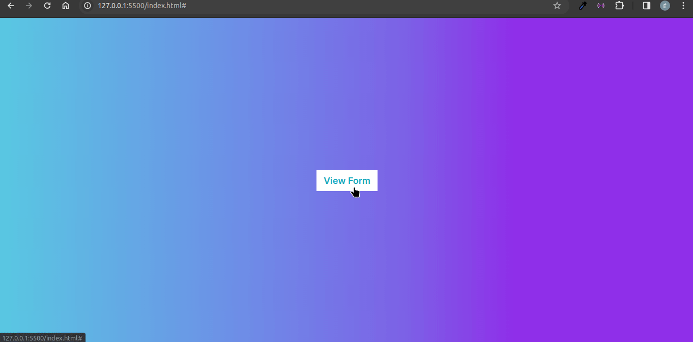

# Formulário Simples

Este formulário é feito com HTML, CSS e JS. Ao clicar no botão "View Form", o formulário é exibido. Para fechá-lo, basta clicar no ícone no canto superior direito do formulário. Assemelha-se a uma janela modal.

## Tecnologias usadas:

- HTML
- CSS
- JavaScript
